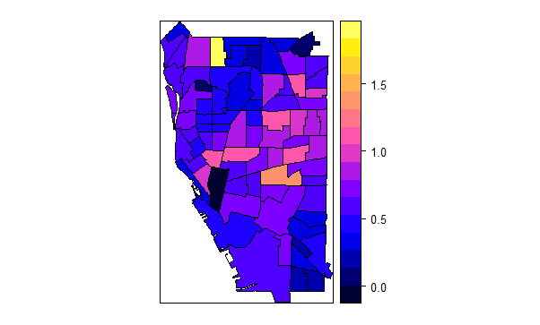

library(rmarkdown)
library(knitr)
---
#Data Science Project  
#Sean Konovitz
#Crime and Census Attributes in Buffalo, New York  
---

# Introduction 
I will be combining crime data using an API from Open Data Buffalo and census data using the census API. The crime data is a daily updated dataset of crime incidents within the city of Buffalo provided by the Buffalo Police Department. This dataset includes the type of incident, such as theft and assault, as well as the time, date, and coordinates. The census data is using American Community Survey (ACS)five-year estimates at the census tract geography level.


# Materials and methods
1. For the crime data, the package RSocrata was used to read the data from Open Data Buffalo into R, as Open Data Buffalo is a website "powered by" Socrata. Socrata is a software company that forms partnerships with governments, such as Buffalo's in 2017 to provide accessible data. In order to open it with the RSocrata package in R, one has to create an account with the site and aquire an app token. This token, along with the username, password and api link are utilized with the function read.socrata() to get it available in R. In this case, it is the crime incidents dataset. As far as geography, spatial data with the 79 census tracts in Buffalo was obtained as well from Open Data Buffalo. To read this into R, the function readOGR() from the rgdal package was used to read the Buffalo tracts shapefile data into R as a SpatialPolgyfgonDataFrame. stringsAsFactors was set to FALSE so character vectors were not converted to factors.

```
load("data/buffcrime.Rda")

```
```
library(rgdal)
openDataTracts <- readOGR("data/geo_export_c9004500-af2b-4c4d-8cde-4de9d5831f2e.shp", stringsAsFactors = FALSE)
```
2. For the census data, the packages tidycensus and tidyverse allowed for the data to be incorporated easily into R. First, one needs to obtain a census API key from https://api.census.gov/data/key_signup.html. Then, the key is put in the census_api_key() and Sys.getenv() functions. 

To get the data itself, the decision has to be made between the decennial, which is performed every ten years, or the Amercan Community Survey (ACS), which are five year estimates with a margin of error. I decided to go with the ACS, as it seemed to provide more variables that may be useful to the project. 

To get the acs data, get_acs() is used and the state, county, geography, variables, and geometry. Since the study area is Buffalo, "NY" and "Erie" were used while "tract" was chosen as the geography since I felt it fits best with the census data. I could have went smaller, to census block groups, but with smaller populations the data may be less reliable. I chose median household income as the variable using the code "B19013_001", since median income is a common measure used. I still change it to a different variable or incorporate an additional one. 

```
library(tidycensus)
library(tidyverse)

erie<- get_acs(state = "NY", county = "Erie", geography = "tract", 
                  variables = "B19013_001", geometry = TRUE)
load("data/eriecensus.Rda")

                 
```
3. To get just the census tracts for Buffalo and not all of Erie County, I merged the Buffalo tracts and the census data by "geoid10_1" and "GEOID" respectively, which have the same values corresponding to census tract. By setting all.y=FALSE, that made it so only the 79 Buffalo tracts and their data remains.sort=FALSE was added so the data would not sort after it forms.

```
openDataTracts@data <- merge(openDataTracts@data, erie, by.x = "geoid10_1", by.y = "GEOID", all.y = FALSE, sort = FALSE)

```
4. Next is to enable the crime data to be used as points by turning it to a SpatialPointsDataFrame. This was done by using the SpatialPointsDataFrame function from sp with longitude(x) and latitude(y)as the coordinates(coords). As.numeric had to be included in this case, so they read as numbers. The coordinate reference system (crs) was set to the proj4string "+init=epsg:4326".

```
library(sp)
crime.spdf <- SpatialPointsDataFrame(coords = cbind(as.numeric(crime$longitude),
                      as.numeric(crime$latitude)), data = crime,
                      proj4string = CRS("+init=epsg:4326"))

```
5. The next part was to count the amount of points (crime incidents) in each polygon(census tracts) using poly.counts() from the GISTools package. 

```
library(GISTools)
crimesInTracts <- poly.counts(crime.spdf, openDataTracts)

```
6. When visualizing it, a certain tract had a disproportionally large rate compared to the others,likely since it is where the Buffalo police are headquartered, so that tract was set to 0. A rate was then created by dividing the counted points in each tract by the total population in each tract, which was given with the shapefile.

```
openDataTracts$crimeCounts <- crimesInTracts
openDataTracts$crimeCounts[which.max(openDataTracts$crimeCounts)] <- 0

openDataTracts$crimeDensity <- openDataTracts$crimeCounts / openDataTracts$total_pop

```
7. A simple chloropleth map was then created using spplot based on the calculated densities. I still have to incorporate the census data such as median income and improve the map layout.


```
library(sp)
spplot(openDataTracts, "crimeDensity")

```
# Results

Still to be determined. 

# Conclusions

To be determined from the results

# References

https://data.buffalony.gov/resource/d6g9-xbgu.json

https://data.buffalony.gov/d/ts8p-7v76?category=Government&view_name=U-S-Census-Tracts-in-BuffaloOpens in new window.

https://walkerke.github.io/tidycensus/articles/spatial-data.html

